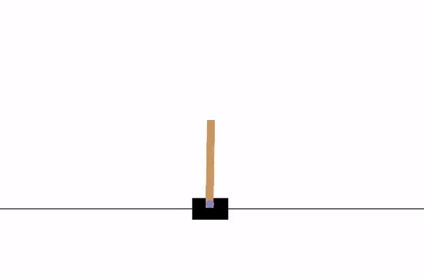
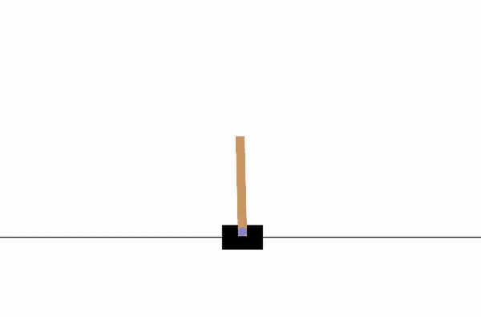

# Deep Reinforcement Learning with A2C on CartPole

Implementation of the Advantage Actor-Critic (A2C) algorithm for training an agent to balance a pole in the CartPole environment using PyTorch and OpenAI Gym.

### Random agent of CartPole-v1:


### My trained agent of CartPole-v1:


## Overview

Reinforcement Learning (RL) is an approach wherein an agent learns to make sequential decisions by interacting with an environment. The objective is for the agent to maximize the cumulative reward it receives over time. The agent goes through this process by repeatedly evaluating the consequences of its actions, trying to select actions that lead to better outcomes.

In this project, we use the `CartPole` environment from OpenAI Gym. In this environment, a pole is attached by an un-actuated joint to a cart, which moves along a frictionless track. The goal is to balance the pole by applying forces in the left and right direction on the cart.

## Algorithm

We will be using the Advantage Actor-Critic (A2C) algorithm. A2C is a reinforcement learning algorithm that consists of an actor (which predicts the best action based on the current state) and a critic (which estimates the state's value function to measure expected future rewards).

The A2C algorithm aims to jointly train both the actor and the critic to improve the policy. It does this by updating the parameters of the actor to increase the likelihood of good actions and updating the parameters of the critic to better estimate the value function.

## Implementation

The implementation is done in Python using PyTorch and OpenAI Gym. The notebook `RL_A2C.ipynb` contains the complete code for training and evaluating the agent.

### Neural Network

We design a simple feed-forward model to embed the observation from the environment to a hidden layer. We then use two fully connected layers on top of the hidden layer to predict the next action and estimate the value of the current state. This acts as both actor and critic.

### Training

The training loop involves the following steps:
1. Reset the environment to its initial state.
2. Gather log probabilities, state values, and rewards from a trajectory.
3. Calculate the discounted rewards.
4. Calculate the advantage.
5. Compute actor and critic losses.
6. Update the model parameters.

### Evaluation

After training, we evaluate the performance of the trained agent using the `choose_action` method.

## Usage

To run the notebook, you can install the required packages using pip:
```sh
pip install torch gym numpy tqdm imageio
```

